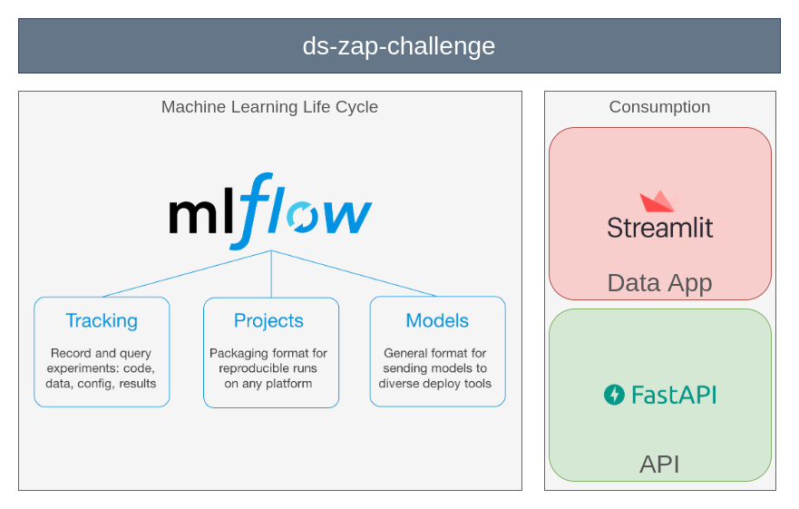

# Data Science Challenge - Grupo ZAP


![](https://img.shields.io/badge/fastapi%20-%2313988a.svg?&style=for-the-badge&logo=data:image/svg+xml;base64,PD94bWwgdmVyc2lvbj0iMS4wIiBlbmNvZGluZz0iVVRGLTgiIHN0YW5kYWxvbmU9Im5vIj8+CjxzdmcKICAgeG1sbnM6ZGM9Imh0dHA6Ly9wdXJsLm9yZy9kYy9lbGVtZW50cy8xLjEvIgogICB4bWxuczpjYz0iaHR0cDovL2NyZWF0aXZlY29tbW9ucy5vcmcvbnMjIgogICB4bWxuczpyZGY9Imh0dHA6Ly93d3cudzMub3JnLzE5OTkvMDIvMjItcmRmLXN5bnRheC1ucyMiCiAgIHhtbG5zOnN2Zz0iaHR0cDovL3d3dy53My5vcmcvMjAwMC9zdmciCiAgIHhtbG5zPSJodHRwOi8vd3d3LnczLm9yZy8yMDAwL3N2ZyIKICAgaWQ9InN2ZzgiCiAgIHZlcnNpb249IjEuMSIKICAgdmlld0JveD0iMCAwIDYuMzQ5OTk5OSA2LjM0OTk5OTkiCiAgIGhlaWdodD0iNi4zNDk5OTk5bW0iCiAgIHdpZHRoPSI2LjM0OTk5OTltbSI+CiAgPGRlZnMKICAgICBpZD0iZGVmczIiIC8+CiAgPG1ldGFkYXRhCiAgICAgaWQ9Im1ldGFkYXRhNSI+CiAgICA8cmRmOlJERj4KICAgICAgPGNjOldvcmsKICAgICAgICAgcmRmOmFib3V0PSIiPgogICAgICAgIDxkYzpmb3JtYXQ+aW1hZ2Uvc3ZnK3htbDwvZGM6Zm9ybWF0PgogICAgICAgIDxkYzp0eXBlCiAgICAgICAgICAgcmRmOnJlc291cmNlPSJodHRwOi8vcHVybC5vcmcvZGMvZGNtaXR5cGUvU3RpbGxJbWFnZSIgLz4KICAgICAgICA8ZGM6dGl0bGU+PC9kYzp0aXRsZT4KICAgICAgPC9jYzpXb3JrPgogICAgPC9yZGY6UkRGPgogIDwvbWV0YWRhdGE+CiAgPGcKICAgICB0cmFuc2Zvcm09InRyYW5zbGF0ZSgtODcuNTM5Mjg2LC04NC40MjYxOTEpIgogICAgIGlkPSJsYXllcjEiPgogICAgPHBhdGgKICAgICAgIGlkPSJwYXRoODE1IgogICAgICAgZD0ibSA4Ny41MzkyODYsODQuNDI2MTkxIGggNi4zNSB2IDYuMzUgaCAtNi4zNSB6IgogICAgICAgc3R5bGU9ImZpbGw6bm9uZTtzdHJva2Utd2lkdGg6MC4yNjQ1ODMzMiIgLz4KICAgIDxwYXRoCiAgICAgICBzdHlsZT0ic3Ryb2tlLXdpZHRoOjAuMjY0NTgzMzI7ZmlsbDojZmZmZmZmIgogICAgICAgaWQ9InBhdGg4MTciCiAgICAgICBkPSJtIDkwLjcxNDI4Niw4NC45NjA2NDkgYyAtMS40NTc4NTQsMCAtMi42NDA1NDIsMS4xODI2ODggLTIuNjQwNTQyLDIuNjQwNTQyIDAsMS40NTc4NTQgMS4xODI2ODgsMi42NDA1NDIgMi42NDA1NDIsMi42NDA1NDIgMS40NTc4NTQsMCAyLjY0MDU0MiwtMS4xODI2ODggMi42NDA1NDIsLTIuNjQwNTQyIDAsLTEuNDU3ODU0IC0xLjE4MjY4OCwtMi42NDA1NDIgLTIuNjQwNTQyLC0yLjY0MDU0MiB6IG0gLTAuMTM3NTgzLDQuNzU3MjA5IHYgLTEuNjU2MjkyIGggLTAuOTIwNzUgbCAxLjMyMjkxNiwtMi41NzcwNDIgdiAxLjY1NjI5MiBoIDAuODg2MzU0IHoiIC8+CiAgPC9nPgo8L3N2Zz4K)
![](https://img.shields.io/badge/Streamlit-E23237?style=for-the-badge&logo=data:image/svg+xml;base64,PD94bWwgdmVyc2lvbj0iMS4wIiBzdGFuZGFsb25lPSJubyI/Pgo8IURPQ1RZUEUgc3ZnIFBVQkxJQyAiLS8vVzNDLy9EVEQgU1ZHIDIwMDEwOTA0Ly9FTiIKICJodHRwOi8vd3d3LnczLm9yZy9UUi8yMDAxL1JFQy1TVkctMjAwMTA5MDQvRFREL3N2ZzEwLmR0ZCI+CjxzdmcgdmVyc2lvbj0iMS4wIiB4bWxucz0iaHR0cDovL3d3dy53My5vcmcvMjAwMC9zdmciCiB3aWR0aD0iMTY2Ny4wMDAwMDBwdCIgaGVpZ2h0PSIxMTk0LjAwMDAwMHB0IiB2aWV3Qm94PSIwIDAgMTY2Ny4wMDAwMDAgMTE5NC4wMDAwMDAiCiBwcmVzZXJ2ZUFzcGVjdFJhdGlvPSJ4TWlkWU1pZCBtZWV0Ij4KCjxnIHRyYW5zZm9ybT0idHJhbnNsYXRlKDAuMDAwMDAwLDExOTQuMDAwMDAwKSBzY2FsZSgwLjEwMDAwMCwtMC4xMDAwMDApIgpmaWxsPSIjMDAwMDAwIiBzdHJva2U9Im5vbmUiPgo8cGF0aCBkPSJNODI2NiA4NTk2IGMtMjIgLTggLTUwIC0yNiAtNjMgLTM5IC0xNCAtMTMgLTM4NCAtNTU5IC04MjMgLTEyMTMKLTQzOSAtNjU0IC04MDMgLTExODggLTgwNyAtMTE4NyAtNSAxIC02OTUgMzY0IC0xNTMzIDgwNyAtMTMzNyA3MDcgLTE1MzAgODA2Ci0xNTY4IDgwNiAtODIgMCAtMTMyIC00OCAtMTMyIC0xMjYgMCAtMjYgMjQyIC02NTUgNzc1IC0yMDE4IDQyNyAtMTA5MCA3ODYKLTIwMDEgNzk4IC0yMDI2IDM0IC03MCAxMzEgLTE2MSAyMTQgLTIwMyAxNDkgLTczIC0xMjUgLTY4IDMyNTMgLTY1IGwzMDM1IDMKNjggMjcgYzEwNCA0MiAxODEgMTAzIDI1MiAxOTggNDcgNjMgMTU5NSA0MDI5IDE1OTUgNDA4NiAwIDc5IC03MiAxNDMgLTE0NwoxMzEgLTE4IC0zIC03MTkgLTM2OSAtMTU1OSAtODEyIC04MzkgLTQ0NCAtMTUzMSAtODA0IC0xNTM3IC04MDIgLTcgMyAtMzcyCjU0MSAtODExIDExOTcgLTYxOSA5MjMgLTgwNyAxMTk3IC04MzYgMTIxNiAtNDYgMzEgLTEyMSAzOSAtMTc0IDIweiIvPgo8L2c+Cjwvc3ZnPgo=&logoColor=white)
![](https://img.shields.io/badge/MLflow-0077B5?style=for-the-badge&logo=data:image/svg+xml;base64,PHN2ZyB3aWR0aD0iMjQiIGhlaWdodD0iMjUiIHZpZXdCb3g9IjAgMCAyNCAyNSIgZmlsbD0ibm9uZSIgeG1sbnM9Imh0dHA6Ly93d3cudzMub3JnLzIwMDAvc3ZnIj4KPHBhdGggZD0iTTE4Ljk1MDkgMi4xNzYzNEMxNC4wNjM1IC0xLjI0MzQ1IDcuNDA5MjYgLTAuNTcxMDUxIDMuMzA0ODUgMy43NTczNUMtMC43OTk1NTYgOC4wODU3NiAtMS4xMTc3NiAxNC43NjYzIDIuNTU2NjcgMTkuNDY1Mkw2LjIyNTI0IDE2Ljc3MjRDNC40MDQyMyAxNC41MTM0IDQuMDM0MzcgMTEuNDEyNCA1LjI3Mjk4IDguNzg4NDNDNi41MTE1OSA2LjE2NDQ4IDkuMTQwOCA0LjQ3OTE0IDEyLjA0MjIgNC40NDkyOUwxMS45NTU0IDcuMzE1ODFMMTguOTUwOSAyLjE3NjM0WiIgZmlsbD0iIzQzQzlFRCIvPgo8cGF0aCBkPSJNMjEuNjYzOSA0Ljg1MTc2QzIxLjU0MjMgNC42ODM4MiAyMS40MTQ5IDQuNTE4NzggMjEuMjg0NiA0LjM1OTUzTDE3Ljc1MjEgNi45NjU0NkMxOS43NDYzIDkuMTcyMzIgMjAuMjYzNyAxMi4zNDI0IDE5LjA3NDYgMTUuMDY4OEMxNy44ODU2IDE3Ljc5NTIgMTUuMjEwNCAxOS41NzI4IDEyLjIzNjIgMTkuNjEyOUwxMi4zMjMxIDE2Ljc0OTNMNS4yNDk0NSAyMS45NjExQzEwLjA5NzEgMjUuMjI1NSAxNi41ODk2IDI0LjUzMzcgMjAuNjQwNiAyMC4zMjEzQzI0LjY5MTcgMTYuMTA4OSAyNS4xMjk1IDkuNTk0MzcgMjEuNjc4NCA0Ljg3NzgyTDIxLjY2MzkgNC44NTE3NloiIGZpbGw9IiMwMTk0RTIiLz4KPC9zdmc+Cg==&logoColor=white)

Machine Learning model that predicts sales prices for apartments based on ads at [www.zapimoveis.com.br](https://www.zapimoveis.com.br/).

The dataset was provided by [Data Science Challenge](https://grupozap.github.io/cultura/challenges/data-science.html) by [Grupo ZAP](https://www.grupozap.com/).

## ⚠ Disclaimer

> This project shouldn't be used in production environment or for decision making without validating its results.
>
> This project has no support lifecycle and has only learning purposes.

---

## Project technologies



### MLflow

**Machine Learning experiments** are tracked and models are saved using MLflow.

More information in [docs/ml_model.md](docs/ml_model.md)

### FastAPI (via Docker)

The project has an **API** (powered by [FastAPI](https://fastapi.tiangolo.com/)) to be consumed by other applications.

More information in [docs/api.md](docs/api.md)

### Streamlit

The project has a **Data App** (powered by [Streamlit](https://www.streamlit.io/)) that facilitates interaction with the model and visualization of the documentation.

[](https://share.streamlit.io/dougtrajano/ds-zap-challenge/main/app.py)

More information in [docs/data_app.md](docs/data_app.md)

### Folders

- **api:** API's code (powered by [FastAPI](https://fastapi.tiangolo.com/)).
- **app:** Data App's code (powered by [Streamlit](https://www.streamlit.io/)).
- **data:** Datasets (raw and processed).
- **docs:** Documentation files.
- **ds_code:** Project code and modeling notebook.
- **mlruns:** Machine learning experiments (powered by [MLFlow](https://www.mlflow.org/)).
- **properties:** Application properties.

---

## Project strategy

The project was divided into 3 parts.

### [ds_code/processing](ds_code/processing)
- Download, extract and preprocess the datasets.
- Provide scripts to be used for all steps.

### [ds_code/exploring](ds_code/exploring)
- Provides some analysis for training dataset.

### [ds_code/modeling](ds_code/modeling)
- Refining the dataset and training the model.
- Experiments are tracked on [MLflow](mlflow.org).

We made a careful feature selection of the datasets (training and test). We include geographic data provided by IBGE Census 2010.

See more information in the project documentation.

---

## Results

The results and some business answers are in [docs/report.md](/docs/report.md) or on the Data App.

---

## Documentation

All documentation about this project is in `.md` (markdown) files in the [docs](/docs)

This documentation is also available on the Data App.

---

## Project setup


All necessary packages are listed in **requirements.txt**.

To install them, run the command below in the project directory.

```
pip install -r requirements.txt
```