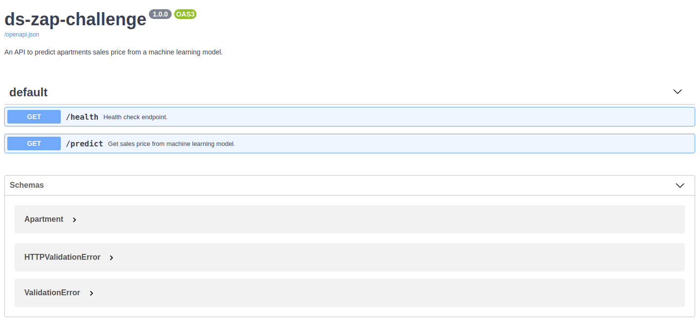
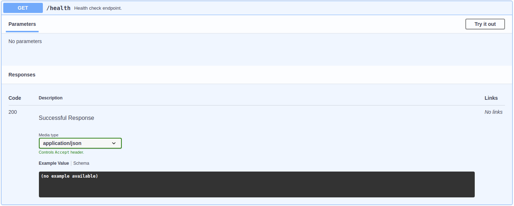
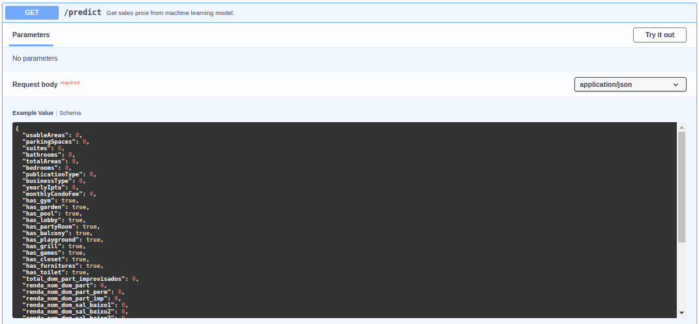

# API - [FastAPI](https://fastapi.tiangolo.com/)

The model is served with an API powered by [FastAPI](https://fastapi.tiangolo.com/) is a modern, fast (high-performance), web framework for building APIs with Python 3.6+ based on standard Python type hints.


---

## API docs

This API has 3 endpoints available.

### `/docs`

Here you will find all the endpoints and how to use them correctly.



### `/health`

Check if API is live.



### `/predict`

Predict sales price from an apartment.
 


---

## How to deploy this API?

The API was developed with FastAPI, see more [here](https://fastapi.tiangolo.com/deployment/docker/).

### Build the Docker image

Go to the project directory (in where your `Dockerfile` is, containing your `app` directory).

Build your FastAPI image:

```
docker build . -t ds-zap-challenge
```

### Start the Docker container

Run a container based on your image:

```
docker run -d --name ds-zap-challenge -p 80:80 ds-zap-challenge
```

Now you have an optimized FastAPI server in a Docker container.

You should be able to interact with this API using your Docker host.