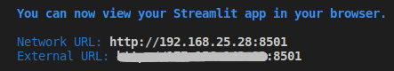

# Data App - [Streamlit](https://www.streamlit.io/)

We have a data app available for this project.

This app was created with [Streamlit](https://www.streamlit.io/). The fastest way to build and share data apps.


---

## How to see this Data App?

[](https://share.streamlit.io/dougtrajano/ds-zap-challenge/main/app.py)

---

## How to run it locally?

### Install Python requirements.

```
pip install -r requirements.txt
```

### Run Streamlit App

```
streamlit run app/main.py
```

### Open one of URLs printed on console by Streamlit.

