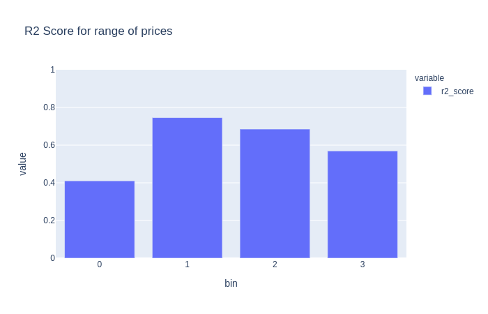

# Modeling

Arquivos:

- code/modeling.py
- code/modeling.ipynb

---

## Métricas

Ao decidir quais métricas fariam mais sentido para o modelo, analisei as seguintes métricas:

- Mean Squared Error - MSE
- Mean Absolute Error - MAE
- Mean Absolute Percentage Error - MAPE

Uma descrição que eu usei para avaliar as métricas e que explica muito bem os objetivos de cada uma pode ser vista [aqui](https://www.mariofilho.com/as-metricas-mais-populares-para-avaliar-modelos-de-machine-learning/)

Enfim, optei por usar a **Mean Squared Error - MSE**, pois no contexto de imóvel, grandes erros nas previsões irão gerar um impacto maior no negócio do que erros menores. Essa métrica irá elevar a diferença na predição ao quadrado, ou seja, quanto maior o erro do modelo, maior a penalização que ele sofrerá.

### Exemplo

Imagine um imóvel de **R$ 500.000,00**.
Se o modelo prever **R$ 450.000,00**, isto é melhor do que o modelo prever **R$ 200.000,00**.

Também será usado a função `score()` do próprio modelo de regressão. Essa função aplica o [coeficiente de determinação - R²](https://pt.wikipedia.org/wiki/Coeficiente_de_determina%C3%A7%C3%A3o).

Complementando nosso conjunto de métricas, pensei em uma métrica de negócio que fizesse mais sentido ao modelo.

Criei então uma métrica binária que avaliará se a predição do modelo ficou entre 75% e 125% do valor real (os valores podem ser ajustados conforme necessário). Essa métrica terá o nome de `price_range_score()`

---

## Refinamento do dataset

Para refinar o dataset, usei algumas técnicas que foram encapsuladas dentro da função `prep_modeling()`.

Remoção de colunas inválidas (identificadas no exploratory_analysis.ipynb)
- Essas variáveis tiveram problemas em seu processamento ou não agregarão valor ao modelo, por isso foram removidas.

Conversão de variáveis categóricas para numéricas
- Optei por desenvolver meu próprio CategoricalEncoder, ele pode ser achado em modeling.py.
- Com ele é possível salvar um arquivo JSON que poderá ser usado posteriormente para explicar as conversões feitas pelo codec. Também existe uma função de `decode()`, foi implementada, mas não foi usada neste projeto.

Dados faltantes
- Para os dados faltantes, foi utilizado o [KNNImputer](https://scikit-learn.org/stable/modules/generated/sklearn.impute.KNNImputer.html) que preenche os dados faltantes utiizando geometria não euclidiana (nan_euclidean) como distância entre os dados vizinhos.

---

## Treinamento do modelo

### Split

O conjunto de dados foi dividido em **train/val** com uma proporção de 0.8 e 0.2 respectivamente.

### Stratify

Também foi aplicada uma estratificação com base na variável target `price` para garantir que tenhamos imóveis de vários grupos de preços (para isto foram gerados bins com base na estatística descritiva da própria variável).

### Cross-validation

Não há divisão em **test**, pois também utilizamos a técnica de [cross-validation](https://scikit-learn.org/stable/modules/cross_validation.html) que fornece uma melhor confiança nos resultados do modelo, visto que todos os dados serão usados em algum momento como conjunto de teste.

### Hyperparameter optimization

Para encontrar os melhores parâmetros, optei por usar [GridSearchCV](http://scikit-learn.org/stable/modules/generated/sklearn.model_selection.GridSearchCV.html) que basicamente irá treinar um modelo para cada combinação possível de parâmetros e avaliar qual possui o melhor desempenho.

Existem técnicas melhores como Bayesian hyperparameter optimization que é mais eficiente nessa tarefa, mas para o momento, GridSearchCV atendeu bem nossa necessidade.

Enfim, os parâmetros que foram testados foram:

```
{
    "n_estimators": [100, 200],
    "max_depth": [5, 10, 20],
    "learning_rate": [1e-1, 1e-2, 1e-3],
    "objective": ["reg:squarederror", "reg:gamma", "reg:tweedie"],
    "booster": ["gbtree", "dart"],
    "random_state": [1993]
}
```

Isto totalizou 540 fits até encontrarmos os melhores parâmetros, segue abaixo:

```
{
    "objective": "reg:squarederror",
    "base_score": 0.5,
    "booster": "gbtree",
    "colsample_bylevel": 1,
    "colsample_bynode": 1,
    "colsample_bytree": 1,
    "gamma": 0,
    "gpu_id": -1,
    "importance_type": "gain",
    "interaction_constraints": "",
    "learning_rate": 0.1,
    "max_delta_step": 0,
    "max_depth": 10,
    "min_child_weight": 1,
    "missing": nan,
    "monotone_constraints": "()",
    "n_estimators": 200,
    "n_jobs": 0,
    "num_parallel_tree": 1,
    "random_state": 1993,
    "reg_alpha": 0,
    "reg_lambda": 1,
    "scale_pos_weight": 1,
    "subsample": 1,
    "tree_method": "exact",
    "validate_parameters": 1,
    "verbosity": 0
}
```

### Modelo

Usei o algoritmo [XGBRegressor](https://xgboost.readthedocs.io/en/latest/python/python_api.html#xgboost.XGBRegressor) neste projeto.

É um algoritmo versátil que atende vários problemas de negócio e com uma implementação simples.

Como trabalho futuro, seria interessante testar outros algoritmos também.

---

## Avaliação

Como visto acima, usei duas métricas: **RME** e **R²** do próprio algoritmo.

Os resultados obtidos com um modelo otimizado no dataset de valiação foram:

```
{'mse': 437329368271.6188, 'r2_score': 0.6344913010274549}
```

O **MSE** serve apenas para otimização do algoritmo, mas analisando o **R²** vemos que exise oportunidade de melhoria no modelo.

O resultado do **cross-validation** foi:

PENDENTE

| Fold | Score |
| - | - |
| 1 | 0.9221 |
| 2 | 0.8914 |
| 3 | 0.9152 |
| 4 | 0.9081 |
| 5 | 0.9092 |

Podemos obter melhores resultados investindo mais tempo na captura das variáveis obtidas através da **descrição do anúncio** ou do **setor censitário do IBGE**, mas para um modelo rápido (19 horas de trabalho), foi um resultado satisfatório.

Abaixo podemos ver 50 predições que o modelo realizou, comparando o **valor real** e o **valor predito**.

| Prediction       | Real             |
|------------------|------------------|
| R$ 566,245\.00   | R$ 244,999\.00   |
| R$ 3,632\.09     | R$ 2,800\.00     |
| R$ 321,288\.75   | R$ 273,009\.00   |
| R$ 202,753\.86   | R$ 188,300\.00   |
| R$ 210,393\.47   | R$ 237,999\.00   |
| R$ 342,602\.00   | R$ 276,500\.00   |
| R$ 222,864\.28   | R$ 230,999\.00   |
| R$ 353,430\.69   | R$ 315,000\.00   |
| R$ 6,298\.46     | R$ 14,699\.00    |
| R$ 472,583\.19   | R$ 540,400\.00   |
| R$ 568,042\.38   | R$ 595,000\.00   |
| R$ 310,801\.28   | R$ 315,000\.00   |
| R$ 430,177\.75   | R$ 409,500\.00   |
| R$ 188,027\.81   | R$ 125,999\.00   |
| R$ 1,210,752\.62 | R$ 1,260,000\.00 |
| R$ 432,217\.62   | R$ 481,282\.00   |
| R$ 531,378\.44   | R$ 581,000\.00   |
| R$ \-38,943\.45  | R$ 2,800\.00     |
| R$ 177,669\.36   | R$ 175,000\.00   |
| R$ 456,728\.03   | R$ 333,900\.00   |
| R$ 829,330\.00   | R$ 1,113,000\.00 |
| R$ 48,757\.94    | R$ 10,500\.00    |
| R$ 329,471\.78   | R$ 382,900\.00   |
| R$ 234,716\.67   | R$ 303,100\.00   |
| R$ 261,036\.31   | R$ 203,000\.00   |
| R$ 249,681\.53   | R$ 280,000\.00   |
| R$ 736,046\.88   | R$ 595,000\.00   |
| R$ 1,303,532\.25 | R$ 1,959,999\.00 |
| R$ 360,316\.59   | R$ 343,000\.00   |
| R$ 510,688\.34   | R$ 455,000\.00   |
| R$ 268,614\.88   | R$ 322,000\.00   |
| R$ 24,943\.19    | R$ 2,100\.00     |
| R$ 203,041\.86   | R$ 178,500\.00   |
| R$ 261,927\.55   | R$ 287,000\.00   |
| R$ 362,859\.38   | R$ 276,500\.00   |
| R$ \-21,323\.62  | R$ 1,120\.00     |
| R$ 377,338\.03   | R$ 422,030\.00   |
| R$ 220,370\.55   | R$ 182,000\.00   |
| R$ 485,511\.25   | R$ 315,000\.00   |
| R$ 509,100\.41   | R$ 475,999\.00   |
| R$ 341,167\.03   | R$ 314,300\.00   |
| R$ 409,819\.03   | R$ 475,999\.00   |
| R$ 1,721,624\.12 | R$ 1,911,195\.00 |
| R$ 319,081\.44   | R$ 332,500\.00   |
| R$ 443,213\.75   | R$ 406,000\.00   |
| R$ \-34,089\.04  | R$ 3,849\.00     |
| R$ 621,345\.38   | R$ 514,499\.00   |
| R$ 261,361\.12   | R$ 175,000\.00   |
| R$ 517,273\.97   | R$ 455,000\.00   |
| R$ 610,620\.75   | R$ 909,300\.00   |

Existem alguns preços negativos que precisam ser ajustados, afinal, ninguém paga para levarem seu imóvel. :)

Isto precisará ser refinado posteriormente, seja com uma função de ativação ou reprocessamento dos dados.

### Price range score

Como explicado acima, usamos a `price_range_score()` como uma métrica de negócio.

No modelo treinado, tivemos um score de **60,28%**, nós temos uma estimativa próxima do valor real do imóvel.

### Faixas de preços

Usamos a mesma técnica de estratificação da base para dividir os imóveis da base de validação em bins.

Com isso, conseguimos avaliar em qual faixa de preço do imóvel o modelo performou melhor ou não.

| Price ranges | Score |
| - | - |
| 0 (até R$ 224.000) | 0.4106 |
| 1 (de R$ 224.001 até R$ 409.500) | 0.7460 |
| 2 (de R$ 409.501 até R$ 770.000) | 0.6853 |
| 3 (acima de R$ 770.001) | 0.5693 |



O modelo não performou bem em imóveis do grupo 0 (preço baixo) e imóveis do grupo 3 (preço alto), como trabalho futuro, precisamos investigar melhor este grupo e entender o que poderia melhor a predição nessa faixa.

---

## Reprodutibilidade

Em **modeling.ipynb** foi definido o `seed` como `1993`.

Também foram colocadas as versões dos pacotes no `requirements.txt`, pois podem existir alterações nos resultados obtidos de acordo com as versões usadas.

O algoritmo utilizado é determinístico.